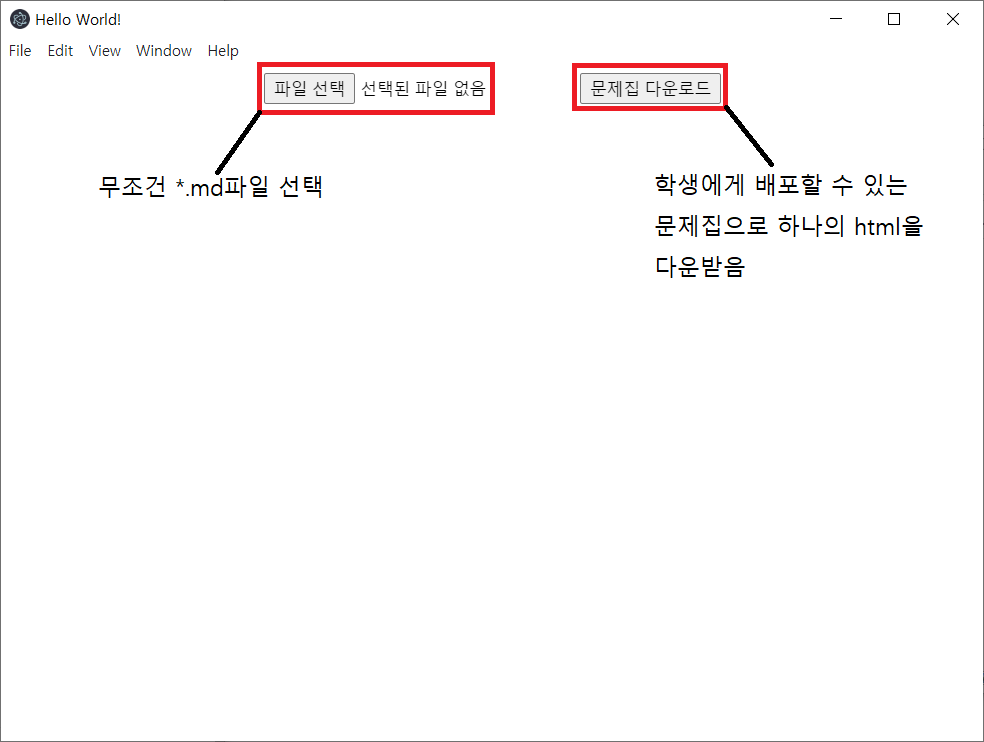
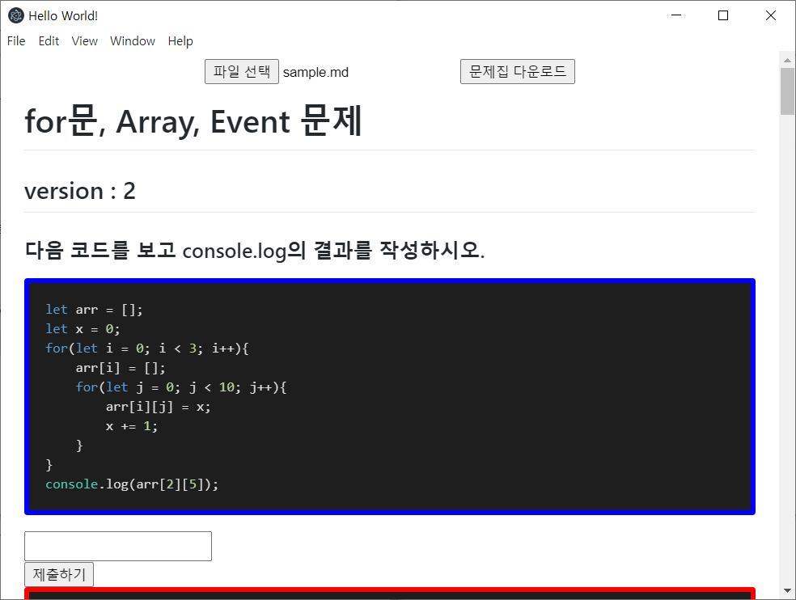

# HomeworkMake


# 1. 프로그램 구성

- src
  - css
    - `mark.css` : 마크다운 스타일시트
    - `vs2015.css` : 하이라이트 스타일시트
  - dev
    - highlight : highlight.js 개조버전
    - marked : marked.js 개조버전
    - `DB.js` : DB 버전 체크 및 새로운 objectStore 등록
    - `hash.js` : 정답 SHA-256으로 해싱
    - `init.js` : 프로그램 시작할 때 쓰임
    - `initSetting.js`
      - `initSetting(code, title, answer, version)`
        - code : highlight 할 부분의 DOM 객체
        - title : 이 문제집의 이름
        - answer : 정답들을 Map 객체로 정리해놓은 것
        - version : 이 문제집의 version
      - `promisify.js` : indexedDB 함수들의 Promise화
      - `test.js` : 문제 생성기의 main js
  - `index.css` : 본 프로그램의 css 파일
  - `index.html` : 본 프로그램의 HTML 파일
  - `index.js` : 본 프로그램 (electron으로 배포 예정)


# 2. 프로그램 사용 방법

1. 프로그램을 열었을 때 나오는 화면

   

   

2. 제대로된 md파일을 열었을 때. (sample 폴더에 있는 것을 사용하길 추천)
   

   

3. 위와 같은 화면이 나오기 위해서는 다음과 같은 양식을 지켜줘야함.

   ```markdown
   # for문, Array, Event 문제 (제목을 쓰지 않으면 작동하지 않음 #으로 인식)
   
   ## version : 2	(version을 쓰지 않으면 무조건 1로 보기 때문에 무조건 작성 부탁, ##으로 인식)
   
   ### 다음 코드를 보고 console.log의 결과를 작성하시오. (써도 되고 안써도 됨.)
   
   ​```javascript
   let arr = [];
   let x = 0;
   for(let i = 0; i < 3; i++){
       arr[i] = [];
       for(let j = 0; j < 10; j++){
           arr[i][j] = x;
           x += 1;
       }
   }
   console.log(arr[2][5]);
   /*%{"num":"0", "ans": "25"}%*/	(답을 관리하는 곳이므로 꼭 작성 부탁 /*% 내용 %*/. 내용은 JSON양식)
   ​```
   
   <input type="text" data-id="0">	
   (input태그은 무엇을 써도 상관 없음 단지 data-id가 무조건 위의 num의 숫자와 동일해야함.)
   
   .
   .
   .
   
   ​```javascript
   let s = '';
   for(let i = 7; i >= 0; i -= 2){
       for(let j = 7; j >= i; j -= 2){
           s = `${s} `;
       }
       for(let j = 0; j < i; j++){
           s = `${s}*`;
       }
       s = `${s}\n`;
   }
   console.log(s);
   /*%{"num":"4", "ans": "*******\n *****\n  ***\n   *"}%*/
   ​```
   
   <textarea style="height: 100px;" data-id="4"></textarea>
   (이렇게 textarea를 써도 상관 없음)
   ```